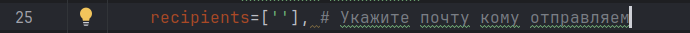
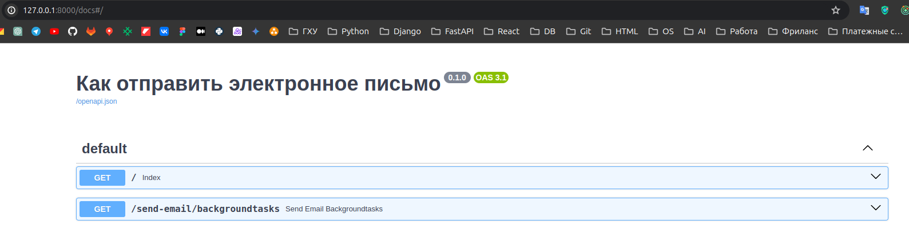

Создайте - файл .env
Укажите данные - 
MAIL_USERNAME=
MAIL_PASSWORD=
MAIL_FROM=
MAIL_PORT=
MAIL_SERVER=
MAIL_FROM_NAME=
MAIL_STARTTLS=
MAIL_SSL_TLS=

Укажите почту кому будем отправлять - 

Установите все зависимости -
pip install -r requirements.txt

Запуск приложения - 
uvicorn main:app --reload

http://127.0.0.1:8000/docs

